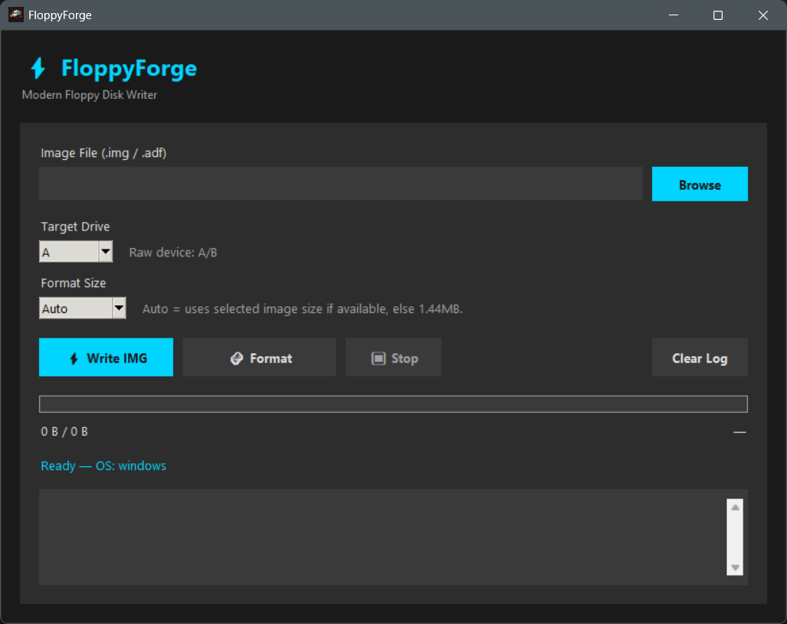

# ⚡ FloppyForge

**FloppyForge** is a modern tool that writes raw floppy disk images (**.img**) directly to a floppy drive.  
It also includes **ADF (Amiga)** support, currently **experimental / in testing**.

✅ **Cross-platform:** Windows / Linux / macOS  
✅ **Tkinter + Python standard library only**  
✅ **Write Image:** raw-write an image to disk  
✅ **Format:** fills the disk with `0x00` (deep wipe, NOT a filesystem format)

---

## 🖼️ Screenshot



---

## ✨ Features

- RAW write `.img` images to floppy disks
- **Format (zero-fill wipe)**: overwrite the entire disk with `0x00`
- Modern dark UI (Tkinter)
- Progress bar + write speed
- Live log output
- **ADF support (Amiga) — experimental / in testing**

---

## ⚠️ ADF (Amiga) Support — Experimental

Writing `.adf` images is **still in testing** and may not produce a working Amiga floppy on all hardware.

Most modern USB floppy drives only support standard PC formats (720KB / 1.44MB).  
For real Amiga disks you often need dedicated hardware (e.g. Greaseweazle / Kryoflux).

FloppyForge will try to write `.adf`, but results depend on your drive/controller.

---

## 🧰 Requirements

- Python **3.10+**
- Windows / Linux / macOS
- Tkinter (included on Windows, may require install on Linux)

# ✅ LICENSE (MIT) 


```txt
MIT License

Copyright (c) 2026

Permission is hereby granted, free of charge, to any person obtaining a copy
of this software and associated documentation files (the "Software"), to deal
in the Software without restriction, including without limitation the rights
to use, copy, modify, merge, publish, distribute, sublicense, and/or sell
copies of the Software, and to permit persons to whom the Software is
furnished to do so, subject to the following conditions:

The above copyright notice and this permission notice shall be included in all
copies or substantial portions of the Software.

THE SOFTWARE IS PROVIDED "AS IS", WITHOUT WARRANTY OF ANY KIND, EXPRESS OR
IMPLIED, INCLUDING BUT NOT LIMITED TO THE WARRANTIES OF MERCHANTABILITY,
FITNESS FOR A PARTICULAR PURPOSE AND NONINFRINGEMENT. IN NO EVENT SHALL THE
AUTHORS OR COPYRIGHT HOLDERS BE LIABLE FOR ANY CLAIM, DAMAGES OR OTHER
LIABILITY, WHETHER IN AN ACTION OF CONTRACT, TORT OR OTHERWISE, ARISING FROM,
OUT OF OR IN CONNECTION WITH THE SOFTWARE OR THE USE OR OTHER DEALINGS IN THE
SOFTWARE.
